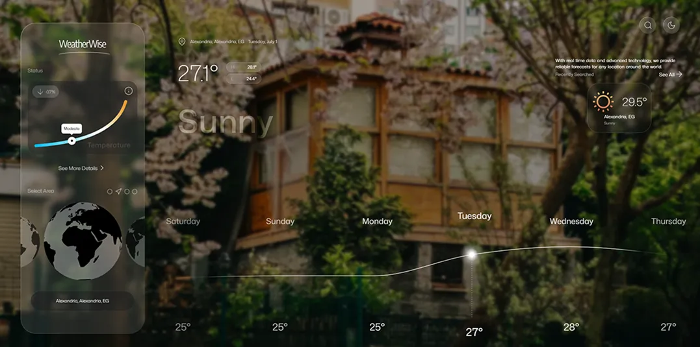

# ⛅ WeatherWise: Global Weather Explorer



A sleek, modern weather application built with React and TypeScript that provides real-time weather information with a beautiful, intuitive interface. WeatherWise offers current conditions, detailed forecasts, and a clean, responsive design that works on any device.

## ✨ Features

- **Current Weather**: Real-time temperature, conditions, and key metrics
- **Detailed Forecast**: Hourly and daily weather predictions
- **Location Search**: Find weather for any city worldwide
- **Responsive Design**: Works seamlessly on desktop and mobile devices
- **Modern UI**: Clean, minimalist interface with smooth animations
- **Weather Metrics**:
  - Temperature (Feels Like)
  - Wind Speed & Direction
  - Humidity Levels
  - UV Index
  - Visibility
  - Air Quality
  - Precipitation
  - Pressure

## 🛠️ Built With

- React 18+
- TypeScript
- Redux Toolkit
- React Select Async Paginate
- Lucide React
- CSS with vendor prefixes for cross-browser compatibility

## Project Structure

```
src/
├── assets/
│   ├── images/
│   ├── icons/
│   └── styles/
├── components/
│   ├── Content/
│   │   └── Components/
│   │       └── HourlyForecast/
│   │       └── SearchedItem/
|   |       └── WeatherChart/
│   │   
|   ├── WeatherWise/
│   │   └── Components/
│   │       └── Bullets/
│   │       └── Earth Swiper/
│   │       └── Earth Status/
|   |       └── Dangerous Rate/
│   └── Header/
│       └── Search/
├── hooks/
├── data/
├── services/
├── store/
|   └── slices/
├── utils/
└── types/
```

## 🚀 Getting Started

### Prerequisites

- Node.js (v14 or later)
- npm or yarn

### Installation

1. Clone the repository:
   ```bash
   git clone https://github.com/yourusername/weatherwise.git
   cd weatherwise
   ```

2. Install dependencies:
   ```bash
   npm install
   # or
   yarn install
   ```

3. Create a `.env` file in the root directory and add your API keys:
   ```
   REACT_APP_GEO_API_BASE_URL=your_geo_api_base_url
   REACT_APP_GEO_API=your_geo_api
   REACT_APP_GEO_API_HOST=your_geo_api_host
   REACT_APP_WEATHER_API_FORECAST_BASE_URL=your_weather_api_forecast_base_url
   REACT_APP_WEATHER_API_HISTORY_BASE_URL=your_weather_api_history_base_url
   REACT_APP_IPINFO_API_BASE_URL=your_ipinfo_api_base_url
   REACT_APP_UNSPLASH_API_BASE_URL=your_unsplash_api_base_url
   ```

4. Start the development server:
   ```bash
   npm start
   # or
   yarn start
   ```

## Usage

1. Search for a city using the search bar or swipe between 4 continental views
2. View current weather conditions and classification status (Good/Moderate/Dangerous)
3. Switch between dark and light mode using the mode toggle
4. View recent 2 search history
5. Get real-time weather updates automatically
6. Monitor health impact parameters (temperature, air quality)
7. Check physical hazard risks (wind, precipitation)
8. Track operational safety metrics (visibility)
9. Review preventable risks (UV, humidity)

## 🙏 Acknowledgments

- Weather data provided by [WeatherAPI.com](https://www.weatherapi.com/)
- Icons by [Lucide Icons](https://lucide.dev/)
- Desktop UI Designed by [Linur](https://dribbble.com/shots/23556592-Weather-Forecasting-Tablet-App-Design)

## 🌦️ Weather Classification System

Our weather classification system categorizes conditions into three levels based on health and safety impact:

### 1. Good (Safe Conditions)
- **Temperature**: 10°C to 25°C (Comfortable range)
- **Air Quality**: us-epa-index 1-3 (Excellent to Good)
- **Wind**: 
  - Speed: ≤ 20 kph (Gentle breeze)
  - Gusts: ≤ 30 kph (Mild gusts)
- **Precipitation**: ≤ 2 mm (Light drizzle)
- **Visibility**: ≥ 8 km (Clear conditions)
- **UV Index**: 0 to 2 (Low risk)
- **Humidity**: 30% to 60% (Comfortable)

### 2. Moderate (Caution Advised)
- **Temperature**: 25°C to 32°C or 0°C to 10°C
- **Air Quality**: us-epa-index 4-6 (Moderate to Sensitive)
- **Wind**: 
  - Speed: 20-40 kph (Moderate breeze)
  - Gusts: 30-60 kph (Strong gusts)
- **Precipitation**: 2-10 mm (Light to moderate rain)
- **Visibility**: 4-8 km (Moderate visibility)
- **UV Index**: 3 to 7 (Moderate to High)
- **Humidity**: 60% to 80% (Humid)

### 3. Dangerous (Action Required)
- **Temperature**: > 32°C or < 0°C
- **Air Quality**: us-epa-index 7-10 (Unhealthy to Hazardous)
- **Wind**: 
  - Speed: > 40 kph (Strong winds)
  - Gusts: > 60 kph (Gale force)
- **Precipitation**: > 10 mm (Heavy rain)
- **Visibility**: < 4 km (Poor visibility)
- **UV Index**: 8+ (Very High to Extreme)
- **Humidity**: > 80% (Very humid)

## Priority System

The app prioritizes weather parameters based on their impact and provides specific recommendations:

1. **Health Impact** (Highest Priority)
   - **Feelslike temperature**: Monitor for heat stroke or hypothermia risks
   - **Air quality (us-epa-index)**: Check for respiratory health risks

2. **Physical Hazard** (Medium Priority)
   - **Wind speed (wind_kph)**: Assess for falling objects or structural damage
   - **Gust speed (gust_kph)**: Prepare for sudden strong winds
   - **Precipitation (precip_mm)**: Check for flooding risks

3. **Operational Safety** (Medium Priority)
   - **Visibility (vis_km)**: Monitor for travel safety
   - **Road conditions**: Check for slippery surfaces

4. **Preventable Risk** (Lowest Priority)
   - **UV Index**: Use sunscreen and protective clothing
   - **Humidity**: Stay hydrated and monitor comfort levels

## Additional Features

1. **Real-time Updates**
   - Automatic weather data refresh
   - Live weather condition tracking
   - Real-time alerts for dangerous conditions

2. **Location Services**
   - Current location detection
   - Global city search
   - Recent locations history

3. **Visual Indicators**
   - Color-coded status indicators
   - Animated weather icons
   - Interactive weather charts

4. **User Interface**
   - Dark/Light mode toggle
   - Responsive design
   - Modern blur effects
   - Smooth animations

## Documentation

- **Weather API Documentation**: [API Documentation](#)
- **React**: [React Documentation](https://reactjs.org)
- **TypeScript**: [TypeScript Documentation](https://www.typescriptlang.org)
- **Redux Toolkit**: [Redux Toolkit Documentation](https://redux-toolkit.js.org)
- **Lucide React**: [Lucide React Documentation](https://lucide.dev/)
- **React Select Async Paginate**: [React Select Async Paginate Documentation](https://github.com/leopardslab/react-select-async-paginate)
- **CSS with vendor prefixes for cross-browser compatibility**: [MDN Web Docs](https://developer.mozilla.org/en-US/docs/Web/CSS/CSS_Properties_Reference)

## Contributing

We welcome contributions! Please follow these guidelines:

1. Fork the repository
2. Create your feature branch (`git checkout -b feature/AmazingFeature`)
3. Commit your changes (`git commit -m 'Add some AmazingFeature'`)
4. Push to the branch (`git push origin feature/AmazingFeature`)
5. Open a Pull Request

## 📝 License

This project is licensed under the MIT License - see the [LICENSE](LICENSE) file for details.